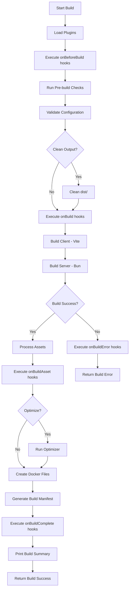

# Build System

**Version:** 1.11.0 | **Updated:** 2025-02-08

## Quick Facts

- Builder class: `FluxStackBuilder` in `core/build/index.ts`
- Dev command: `bun run dev` (hot reload with `--watch`)
- Build command: `bun run build` (production optimized)
- Modes: Full-stack, Frontend-only, Backend-only
- Bundler: Bun native bundler
- Frontend: Vite for React development
- Docker: Multi-stage production images

## Development Mode

### Full-Stack Development

```bash
bun run dev
# or
bun run core/cli/index.ts dev
```

**What Happens**:
1. Spawns `bun --watch app/server/index.ts`
2. Bun watches for file changes (hot reload)
3. Server starts on `BACKEND_PORT` (default: 3000)
4. Vite plugin starts frontend on `VITE_PORT` (default: 5173)
5. Backend proxies frontend requests to Vite

**Environment Variables**:
```bash
FLUXSTACK_MODE=full-stack
BACKEND_PORT=3000
FRONTEND_PORT=5173
NODE_ENV=development
```

**File Watching**:
- Bun's `--watch` flag monitors all imported files
- Changes trigger automatic restart
- Fast reload (< 1 second typically)
- Preserves process state where possible

### Frontend-Only Mode

```bash
bun run dev --frontend-only
# or
bun run dev:frontend
```

**What Happens**:
1. Spawns `bun --watch core/client/standalone-entry.ts`
2. Starts Vite dev server only
3. No backend server running
4. Useful for UI development

**Use Cases**:
- Pure frontend development
- Working with mock data
- UI component development
- Faster startup when backend not needed

### Backend-Only Mode

```bash
bun run dev --backend-only
# or
bun run dev:backend
```

**What Happens**:
1. Spawns `bun --watch app/server/index.ts`
2. Starts Elysia server only
3. No Vite dev server
4. Vite plugin disabled

**Environment Variables**:
```bash
FLUXSTACK_MODE=backend-only
```

**Use Cases**:
- API development
- Testing backend logic
- Working with external frontend
- Faster startup when frontend not needed

### Custom Ports

```bash
bun run dev --port 4000 --frontend-port 8080
```

## Production Build

### Full Build

```bash
bun run build
# or
cross-env NODE_ENV=production bun run core/cli/index.ts build
```

**Build Process**:



**Output Structure**:
```
dist/
├── client/              # Vite build output
│   ├── assets/         # JS, CSS, images
│   ├── index.html      # Entry HTML
│   └── ...
├── index.js            # Bundled server
├── package.json        # Dependencies for Docker
├── .env                # Production environment
├── Dockerfile          # Production Docker image
├── docker-compose.yml  # Docker Compose config
└── .dockerignore       # Docker ignore rules
```

### Frontend-Only Build

```bash
bun run build --frontend-only
# or
bun run build:frontend
```

**What Happens**:
1. Runs Vite build only
2. Outputs to `dist/client/`
3. Optimized for production (minified, tree-shaken)
4. No server bundle created

**Use Cases**:
- Static site deployment
- CDN hosting
- Separate frontend deployment

### Backend-Only Build

```bash
bun run build --backend-only
# or
bun run build:backend
```

**What Happens**:
1. Runs Bun bundler only
2. Bundles `app/server/index.ts` to `dist/index.js`
3. No frontend build
4. Includes all server dependencies

**Use Cases**:
- API-only deployment
- Microservice deployment
- Separate backend deployment

## Build Configuration

### Build Options

From `config/system/build.config.ts`:

```typescript
{
  target: 'bun',              // Build target (bun, node)
  outDir: 'dist',             // Output directory
  mode: 'production',         // Build mode
  sourceMaps: false,          // Generate source maps
  minify: true,               // Minify output
  clean: true,                // Clean output before build
  optimize: true,             // Run optimizer
  external: []                // External dependencies
}
```

### Client Build Options

From `config/system/client.config.ts`:

```typescript
{
  outDir: 'dist/client',      // Client output directory
  sourceMaps: false,          // Generate source maps
  minify: true,               // Minify output
  treeshake: true,            // Remove unused code
  compress: true              // Compress assets
}
```

### Optimization Options

From `config/system/optimization.config.ts`:

```typescript
{
  minify: true,               // Minify JS/CSS
  treeshake: true,            // Remove dead code
  compress: true,             // Compress output
  removeUnusedCSS: false,     // Remove unused CSS
  optimizeImages: false,      // Optimize images
  bundleAnalyzer: false       // Generate bundle analysis
}
```

## Bundler

### Bun Bundler

**Features**:
- Native Bun bundler (fast)
- Supports TypeScript natively
- Tree-shaking enabled
- Minification built-in
- Source maps optional

**Server Bundling**:
```typescript
await bundler.bundleServer("app/server/index.ts")
```

**Output**:
- Single `dist/index.js` file
- All dependencies bundled
- External packages excluded (if configured)

### Vite Bundler

**Features**:
- React Fast Refresh
- Hot Module Replacement (HMR)
- CSS preprocessing
- Asset optimization
- Code splitting

**Client Bundling**:
```typescript
await bundler.bundleClient({
  env: {
    VITE_BUILD_OUTDIR: 'dist/client',
    VITE_BUILD_SOURCEMAPS: 'false'
  }
})
```

**Output**:
- `dist/client/index.html`
- `dist/client/assets/*.js` (code-split chunks)
- `dist/client/assets/*.css`
- Optimized images and fonts

## Optimizer

### Optimization Process

When `optimize: true`:

1. **Minification**: Compress JS/CSS
2. **Tree-shaking**: Remove unused code
3. **Compression**: Gzip/Brotli compression
4. **CSS Optimization**: Remove unused CSS (if enabled)
5. **Image Optimization**: Compress images (if enabled)

**Metrics Tracked**:
```typescript
{
  originalSize: number,       // Size before optimization
  optimizedSize: number,      // Size after optimization
  compressionRatio: number,   // Percentage saved
  duration: number            // Time taken
}
```

## Docker Configuration

### Dockerfile

Generated in `dist/Dockerfile`:

```dockerfile
FROM oven/bun:1.3-alpine AS production

WORKDIR /app

# Copy package.json first for better caching
COPY package.json ./

# Install dependencies
RUN bun install --frozen-lockfile

# Copy built application
COPY . .

# Create non-root user
RUN addgroup -g 1001 -S fluxstack && \
    adduser -S fluxstack -u 1001

# Set permissions
RUN chown -R fluxstack:fluxstack /app
USER fluxstack

# Environment variables
ENV NODE_ENV=production
ENV PORT=3000

# Health check
HEALTHCHECK --interval=30s --timeout=3s --start-period=5s --retries=3 \
  CMD bun run -e "fetch('http://localhost:3000/api/health').then(r => r.ok ? process.exit(0) : process.exit(1))" || exit 1

# Expose port
EXPOSE 3000

# Start the application
CMD ["bun", "run", "index.js"]
```

**Features**:
- Multi-stage build (production only)
- Alpine Linux (small image size)
- Non-root user (security)
- Health check (container orchestration)
- Frozen lockfile (reproducible builds)

### docker-compose.yml

Generated in `dist/docker-compose.yml`:

```yaml
version: '3.8'

services:
  fluxstack:
    build: .
    ports:
      - "3000:3000"
    environment:
      - NODE_ENV=production
      - PORT=3000
    restart: unless-stopped
    healthcheck:
      test: ["CMD", "bun", "run", "-e", "fetch('http://localhost:3000/api/health').then(r => r.ok ? process.exit(0) : process.exit(1))"]
      interval: 30s
      timeout: 3s
      retries: 3
    deploy:
      resources:
        limits:
          memory: 512M
        reservations:
          memory: 256M
```

**Features**:
- Resource limits (memory)
- Health checks
- Restart policy
- Port mapping

### .dockerignore

Generated in `dist/.dockerignore`:

```
node_modules
.git
.gitignore
README.md
.env.local
.env.*.local
*.log
coverage
.vscode
.idea
```

**Purpose**: Reduce Docker context size and build time

## Build Hooks

Plugins can hook into build process:

### onBeforeBuild

Execute before build starts:
```typescript
onBeforeBuild: async (context: BuildContext) => {
  // Validate environment
  // Generate code
  // Clean directories
}
```

### onBuild

Execute during build:
```typescript
onBuild: async (context: BuildContext) => {
  // Custom build steps
  // Generate assets
  // Transform code
}
```

### onBuildAsset

Execute for each built asset:
```typescript
onBuildAsset: async (context: BuildAssetContext) => {
  // context.assetPath - file path
  // context.assetType - 'js' | 'css' | 'html' | 'image' | 'font' | 'other'
  // context.size - file size
  
  // Optimize asset
  // Upload to CDN
  // Generate metadata
}
```

### onBuildComplete

Execute after successful build:
```typescript
onBuildComplete: async (context: BuildContext) => {
  // Upload artifacts
  // Send notifications
  // Update deployment
}
```

### onBuildError

Execute on build failure:
```typescript
onBuildError: async (context: BuildErrorContext) => {
  // context.error - the error
  // context.file - file that caused error (if known)
  // context.line - line number (if known)
  
  // Log error
  // Send alert
  // Cleanup
}
```

## Build Manifest

Generated in `dist/manifest.json`:

```json
{
  "version": "1.11.0",
  "timestamp": "2025-02-08T12:00:00.000Z",
  "target": "bun",
  "mode": "production",
  "client": {
    "entryPoints": [],
    "chunks": [],
    "assets": ["index.html", "assets/index-abc123.js"],
    "publicPath": "/"
  },
  "server": {
    "entryPoint": "index.js",
    "dependencies": [],
    "externals": []
  },
  "optimization": {
    "minified": true,
    "treeshaken": true,
    "compressed": true,
    "originalSize": 1048576,
    "optimizedSize": 524288,
    "compressionRatio": 50.0
  },
  "metrics": {
    "buildTime": 5000,
    "bundleTime": 3000,
    "optimizationTime": 1000,
    "totalSize": 524288,
    "gzippedSize": 262144,
    "chunkCount": 5,
    "assetCount": 10
  }
}
```

## Pre-build Checks

Automatic checks before build:

1. **Version Sync**: Sync version across package.json files
2. **Configuration Validation**: Ensure valid build config
3. **Dependency Check**: Verify all dependencies installed

## Build Summary

After successful build, displays:

```
✓ Build Completed Successfully

  Build Time:        5.2s
  Output Directory:  dist
  Client Assets:     10
  Total Size:        512 KB
  Compression:       50.00%
  Docker Ready:      ✓
```

## Deployment

### Docker Deployment

```bash
cd dist
docker build -t fluxstack-app .
docker run -p 3000:3000 fluxstack-app
```

Or with Docker Compose:
```bash
cd dist
docker-compose up -d
```

### Direct Deployment

```bash
cd dist
bun install --production
bun run index.js
```

## Performance Tips

1. **Use --frontend-only**: Faster builds when backend unchanged
2. **Use --backend-only**: Faster builds when frontend unchanged
3. **Disable Source Maps**: Faster production builds
4. **Enable Optimization**: Smaller bundle sizes
5. **Use Docker**: Consistent deployment environment

## Troubleshooting

### Build Fails

- Check `onBuildError` hook logs
- Verify all dependencies installed
- Check TypeScript errors
- Validate configuration

### Large Bundle Size

- Enable tree-shaking
- Check for duplicate dependencies
- Use bundle analyzer
- Externalize large dependencies

### Slow Builds

- Disable source maps
- Use incremental builds
- Check plugin hooks (may be slow)
- Reduce optimization level

## Related

- [Framework Lifecycle](./framework-lifecycle.md) - Build hooks integration
- [Plugin System](./plugin-system.md) - Build hook details
- [CLI Commands](../reference/cli-commands.md) - Build command options
