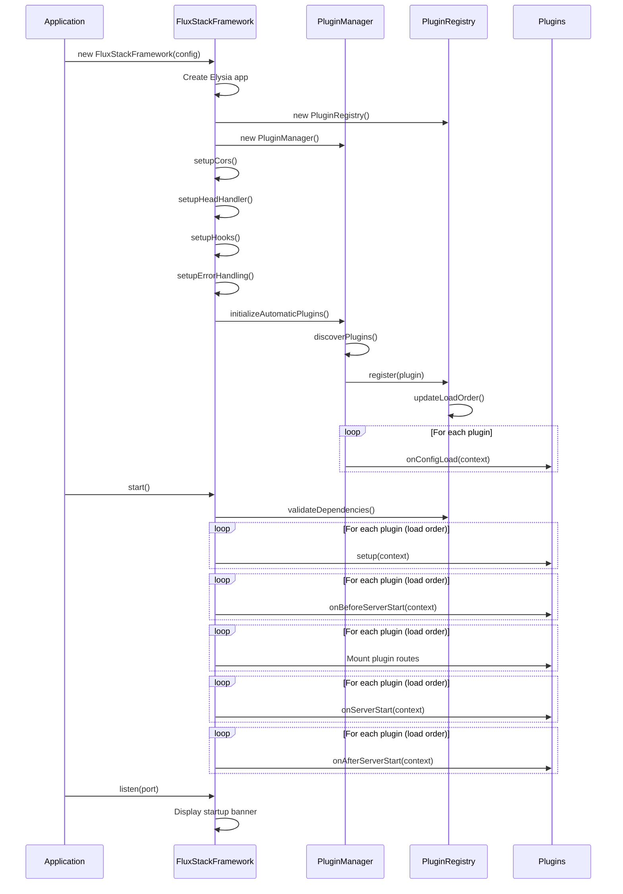
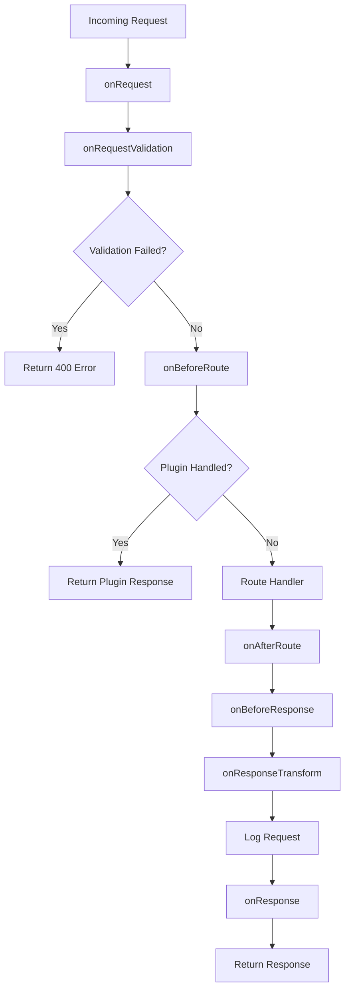
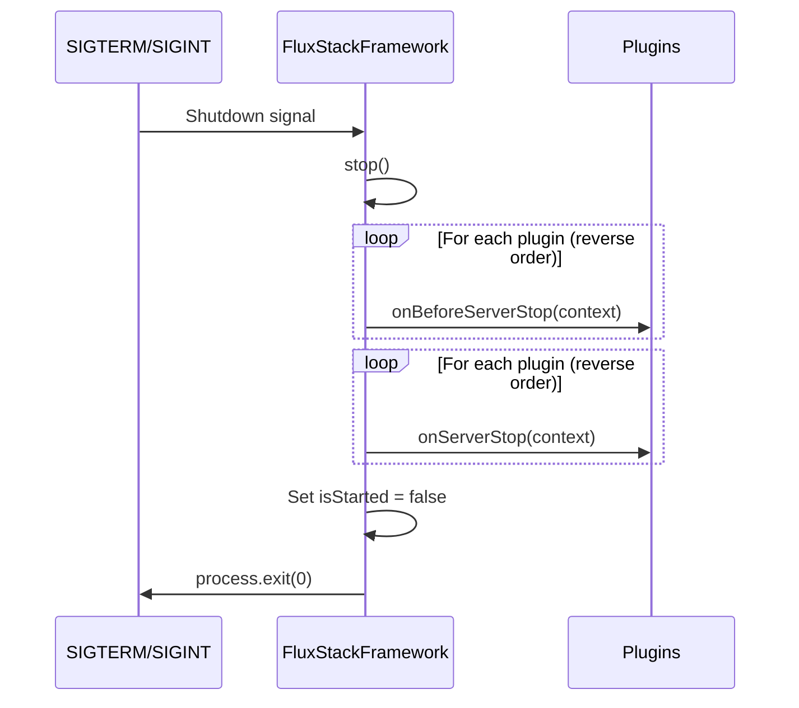

# Framework Lifecycle

**Version:** 1.11.0 | **Updated:** 2025-02-08

## Quick Facts

- Framework class: `FluxStackFramework` in `core/framework/server.ts`
- Initialization: Constructor → Plugin Discovery → Setup Hooks → Server Start
- Request flow: 13 hook points from request to response
- Shutdown: Graceful with reverse-order plugin cleanup
- Plugin loading: Dependency-based topological sort with priority

## Initialization Sequence



## Plugin Loading Order

Plugins are loaded in dependency-aware order:

1. **Discovery Phase** (automatic, during constructor):
   - Scan `plugins/` directory (project plugins)
   - Scan `node_modules/` for npm plugins (if enabled)
   - Whitelist validation for npm plugins
   - Dependency resolution

2. **Registration Phase**:
   - Validate plugin structure
   - Store in registry
   - Build dependency graph
   - Calculate load order (topological sort)

3. **Configuration Phase** (during `initializeAutomaticPlugins()`):
   - Execute `onConfigLoad` hooks in load order
   - Plugins can modify configuration

4. **Setup Phase** (during `start()`):
   - Validate all dependencies exist
   - Execute `setup` hooks in load order
   - Execute `onBeforeServerStart` hooks
   - Mount plugin routes (if plugin has Elysia plugin)
   - Execute `onServerStart` hooks
   - Execute `onAfterServerStart` hooks

## Hook Execution Order

### Lifecycle Hooks

```
onConfigLoad → setup → onBeforeServerStart → onServerStart → onAfterServerStart
```

- **onConfigLoad**: Modify configuration before framework starts
- **setup**: Initialize plugin resources (databases, connections)
- **onBeforeServerStart**: Register routes, middleware
- **onServerStart**: Start background tasks
- **onAfterServerStart**: Post-startup tasks (logging, metrics)

### Request/Response Pipeline



**Hook Execution Order:**

1. **onRequest**: Log request, authenticate, add context
2. **onRequestValidation**: Custom validation logic
3. **onBeforeRoute**: Handle request before routing (auth, caching)
4. **[Route Handler Executes]**
5. **onAfterRoute**: Access route params, log matched route
6. **onBeforeResponse**: Modify headers, status code
7. **onResponseTransform**: Transform response body
8. **[Automatic Request Logging]**
9. **onResponse**: Final logging, metrics collection

### Error Handling Flow

```
Error Occurs → onError (each plugin) → Plugin Handled? → Return Response or Default Error
```

- Plugins can handle errors by setting `context.handled = true`
- Vite plugin uses this for SPA fallback
- FluxStackError instances use custom status codes
- Unhandled errors return 500 with message (dev) or generic (prod)

## Request Lifecycle Details

### CORS Setup

Applied via `onRequest` hook:
- Sets `Access-Control-Allow-Origin`
- Sets `Access-Control-Allow-Methods`
- Sets `Access-Control-Allow-Headers`
- Handles OPTIONS preflight requests

### HEAD Request Handling

Global HEAD handler prevents Elysia bug:
- Returns empty body with appropriate headers
- API routes: `Content-Type: application/json`
- Static files: `Content-Type: text/html` or appropriate type

### Request Timing

- Start time stored in `onRequest`
- Duration calculated in `onAfterHandle`
- Timing key stored in response headers
- Cleanup after response sent

## Shutdown Sequence



**Shutdown Hooks:**

1. **onBeforeServerStop**: Prepare for shutdown (stop accepting requests)
2. **onServerStop**: Cleanup resources (close connections, save state)

**Reverse Order**: Plugins shut down in reverse of load order to respect dependencies

## Plugin Context

Every plugin receives a `PluginContext` object:

```typescript
{
  config: FluxStackConfig,      // Full framework configuration
  logger: Logger,                // Plugin-specific logger
  app: Elysia,                   // Elysia app instance
  utils: PluginUtils,            // Utility functions
  registry: PluginRegistry       // Access to other plugins
}
```

## Error Recovery

- Plugin hook failures are caught and logged
- `onPluginError` hook notified on all other plugins
- Framework continues execution (non-blocking)
- Build hooks can stop build on error

## Performance Considerations

- Plugin discovery is asynchronous (non-blocking)
- Hooks execute sequentially (predictable order)
- Request timing tracked with minimal overhead
- Automatic cleanup of timing data

## Related

- [Plugin System](./plugin-system.md) - Plugin architecture details
- [Plugin Hooks Reference](../reference/plugin-hooks.md) - Complete hook list
- [Build System](./build-system.md) - Build lifecycle
