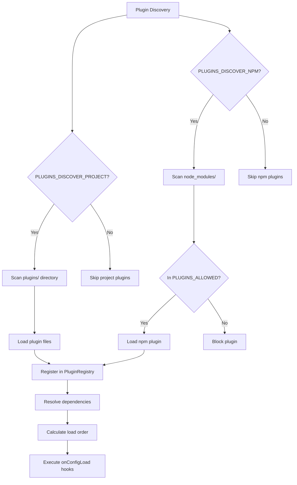

# Plugin System

**Version:** 1.11.0 | **Updated:** 2025-02-08

## Quick Facts

- Plugin interface: `FluxStack.Plugin` in `core/plugins/types.ts`
- Registry: `PluginRegistry` manages all plugins
- Manager: `PluginManager` handles lifecycle and execution
- Discovery: Automatic from `plugins/` and `node_modules/`
- Security: Whitelist system for npm plugins
- Dependencies: Automatic resolution with topological sort

## Plugin Interface

```typescript
interface FluxStack.Plugin {
  // Required
  name: string
  
  // Optional metadata
  version?: string
  description?: string
  author?: string
  dependencies?: string[]        // Plugin dependencies
  priority?: number | PluginPriority
  category?: string
  tags?: string[]
  
  // Lifecycle hooks (20+ available)
  setup?: (context: PluginContext) => void | Promise<void>
  onConfigLoad?: (context: ConfigLoadContext) => void | Promise<void>
  onBeforeServerStart?: (context: PluginContext) => void | Promise<void>
  onServerStart?: (context: PluginContext) => void | Promise<void>
  onAfterServerStart?: (context: PluginContext) => void | Promise<void>
  onBeforeServerStop?: (context: PluginContext) => void | Promise<void>
  onServerStop?: (context: PluginContext) => void | Promise<void>
  
  // Request/Response hooks
  onRequest?: (context: RequestContext) => void | Promise<void>
  onBeforeRoute?: (context: RequestContext) => void | Promise<void>
  onAfterRoute?: (context: RouteContext) => void | Promise<void>
  onBeforeResponse?: (context: ResponseContext) => void | Promise<void>
  onResponse?: (context: ResponseContext) => void | Promise<void>
  onRequestValidation?: (context: ValidationContext) => void | Promise<void>
  onResponseTransform?: (context: TransformContext) => void | Promise<void>
  
  // Error handling
  onError?: (context: ErrorContext) => void | Promise<void>
  
  // Build hooks
  onBeforeBuild?: (context: BuildContext) => void | Promise<void>
  onBuild?: (context: BuildContext) => void | Promise<void>
  onBuildAsset?: (context: BuildAssetContext) => void | Promise<void>
  onBuildComplete?: (context: BuildContext) => void | Promise<void>
  onBuildError?: (context: BuildErrorContext) => void | Promise<void>
  
  // Plugin system hooks
  onPluginRegister?: (context: PluginEventContext) => void | Promise<void>
  onPluginUnregister?: (context: PluginEventContext) => void | Promise<void>
  onPluginError?: (context: PluginEventContext & { error: Error }) => void | Promise<void>
  
  // CLI commands
  commands?: CliCommand[]
}
```

## Plugin Discovery

### Built-in vs External Plugins

**Built-in Plugins** (`core/plugins/built-in/`):
- Part of framework core
- Manually registered via `.use(plugin)`
- Examples: vite, swagger, static, live-components
- No automatic discovery (developer chooses)

**Project Plugins** (`plugins/`):
- User-created plugins in project
- Automatically discovered if `PLUGINS_DISCOVER_PROJECT=true`
- Always trusted (no whitelist required)
- Can have local dependencies

**NPM Plugins** (`node_modules/`):
- Third-party plugins from npm
- Automatically discovered if `PLUGINS_DISCOVER_NPM=true`
- **Requires whitelist** (`PLUGINS_ALLOWED` env var)
- Naming patterns:
  - `fluxstack-plugin-*`
  - `fplugin-*`
  - `@fluxstack/plugin-*`
  - `@fplugin/*`
  - `@org/fluxstack-plugin-*`
  - `@org/fplugin-*`

### Discovery Process



## Plugin Security

### Whitelist System

**Purpose**: Prevent supply chain attacks from malicious npm packages

**Configuration**:
```bash
# Enable npm plugin discovery
PLUGINS_DISCOVER_NPM=true

# Whitelist specific plugins
PLUGINS_ALLOWED=fluxstack-plugin-auth,@acme/fplugin-payments
```

**Security Model**:
- Project plugins (`plugins/`) are **always trusted** (developer added them)
- NPM plugins (`node_modules/`) **require whitelist** (supply chain protection)
- Empty whitelist = no npm plugins allowed
- Blocked plugins logged with warning

**Example**:
```typescript
// ✅ Project plugin - always allowed
plugins/my-plugin/index.ts

// ❌ NPM plugin without whitelist - blocked
node_modules/fluxstack-plugin-malicious/

// ✅ NPM plugin in whitelist - allowed
node_modules/fluxstack-plugin-auth/  // if in PLUGINS_ALLOWED
```

## Dependency Resolution

### Dependency Declaration

```typescript
export default {
  name: 'my-plugin',
  dependencies: ['database', 'auth'],  // Requires these plugins
  setup: async (context) => {
    // Can safely use database and auth plugins
  }
}
```

### Load Order Algorithm

1. **Build Dependency Graph**: Map all plugin dependencies
2. **Topological Sort**: Order plugins so dependencies load first
3. **Circular Detection**: Throw error if circular dependency found
4. **Priority Sort**: Within dependency groups, sort by priority

**Priority Values**:
- `highest` or `100+`: Load first (core infrastructure)
- `high` or `50-99`: Load early (auth, database)
- `normal` or `0-49`: Default (most plugins)
- `low` or `-50 to -1`: Load late (monitoring)
- `lowest` or `-100 or less`: Load last (cleanup)

**Example Load Order**:
```
database (priority: 100, no deps)
  ↓
auth (priority: 50, deps: [database])
  ↓
api (priority: 0, deps: [auth])
  ↓
monitoring (priority: -50, deps: [api])
```

## Plugin Registry

### PluginRegistry Class

**Responsibilities**:
- Store all registered plugins
- Manage plugin manifests
- Calculate load order
- Validate dependencies
- Discover plugins from filesystem

**Key Methods**:
```typescript
register(plugin: Plugin, manifest?: PluginManifest): Promise<void>
unregister(name: string): Promise<void>
get(name: string): Plugin | undefined
getAll(): Plugin[]
getLoadOrder(): string[]
getDependencies(pluginName: string): string[]
getDependents(pluginName: string): string[]
has(name: string): boolean
discoverPlugins(options: PluginDiscoveryOptions): Promise<PluginLoadResult[]>
discoverNpmPlugins(): Promise<PluginLoadResult[]>
```

### Plugin Manifest

Optional `plugin.json` or `package.json` with `fluxstack` field:

```json
{
  "name": "fluxstack-plugin-auth",
  "version": "1.0.0",
  "description": "Authentication plugin",
  "author": "Your Name",
  "license": "MIT",
  "dependencies": {
    "jsonwebtoken": "^9.0.0"
  },
  "fluxstack": {
    "version": "1.11.0",
    "hooks": ["setup", "onRequest", "onBeforeRoute"],
    "category": "security",
    "tags": ["auth", "jwt"]
  }
}
```

## Plugin Manager

### PluginManager Class

**Responsibilities**:
- Initialize plugin system
- Execute plugin hooks
- Manage plugin contexts
- Track plugin metrics
- Handle hook errors

**Key Methods**:
```typescript
initialize(): Promise<void>
shutdown(): Promise<void>
registerPlugin(plugin: Plugin): Promise<void>
unregisterPlugin(name: string): void
executeHook(hook: PluginHook, context?: any, options?: HookExecutionOptions): Promise<PluginHookResult[]>
executePluginHook(plugin: Plugin, hook: PluginHook, context?: any): Promise<PluginHookResult>
getPluginMetrics(pluginName?: string): PluginMetrics | Map<string, PluginMetrics>
```

### Hook Execution

**Sequential Execution** (default):
```typescript
await pluginManager.executeHook('onRequest', requestContext)
// Plugins execute in load order, one at a time
```

**Parallel Execution**:
```typescript
await pluginManager.executeHook('onBuild', buildContext, { parallel: true })
// All plugins execute simultaneously
```

**Options**:
- `timeout`: Max execution time (default: 30s)
- `parallel`: Execute all plugins at once
- `stopOnError`: Stop if any plugin fails
- `retries`: Retry failed hooks (default: 0)

### Plugin Metrics

Tracked per plugin:
```typescript
{
  loadTime: number,              // Time to load plugin
  setupTime: number,             // Time to execute setup hook
  hookExecutions: Map<PluginHook, number>,  // Count per hook
  errors: number,                // Total errors
  warnings: number,              // Total warnings
  lastExecution?: Date           // Last hook execution time
}
```

## Plugin Context

Every hook receives appropriate context:

### PluginContext (Lifecycle Hooks)
```typescript
{
  config: FluxStackConfig,       // Full configuration
  logger: Logger,                // Plugin-specific logger
  app: Elysia,                   // Elysia app instance
  utils: PluginUtils,            // Utility functions
  registry: PluginRegistry       // Access other plugins
}
```

### RequestContext (Request Hooks)
```typescript
{
  request: Request,
  path: string,
  method: string,
  headers: Record<string, string>,
  query: Record<string, string>,
  params: Record<string, string>,
  body?: any,
  user?: any,
  startTime: number,
  handled?: boolean,             // Set to true to handle request
  response?: Response            // Set to return custom response
}
```

### ResponseContext (Response Hooks)
```typescript
{
  ...RequestContext,
  response: Response,
  statusCode: number,
  duration: number,
  size?: number
}
```

### ErrorContext (Error Hooks)
```typescript
{
  ...RequestContext,
  error: Error,
  duration: number,
  handled: boolean               // Set to true to handle error
}
```

## Plugin Utilities

Available in `context.utils`:

```typescript
{
  createTimer: (label: string) => { end: () => number },
  formatBytes: (bytes: number) => string,
  isProduction: () => boolean,
  isDevelopment: () => boolean,
  getEnvironment: () => string,
  createHash: (data: string) => string,
  deepMerge: (target: any, source: any) => any,
  validateSchema: (data: any, schema: any) => { valid: boolean; errors: string[] }
}
```

## Error Handling

### Hook Failures

- Caught and logged automatically
- Other plugins notified via `onPluginError` hook
- Framework continues execution (non-blocking)
- Metrics updated with error count

### Plugin Errors

```typescript
onPluginError: async (context) => {
  // context.pluginName - which plugin failed
  // context.error - the error that occurred
  // context.timestamp - when it happened
  
  // Log to monitoring service
  await monitoring.logPluginError(context)
}
```

## Dependency Management

### Automatic Installation

**Project Plugins**:
- Dependencies installed in plugin directory
- Runs `bun install` in plugin folder
- Isolated from main project dependencies

**NPM Plugins**:
- Dependencies must be manually reviewed
- Run `bun run flux plugin:deps install <plugin-name>`
- Security: prevents automatic malicious package installation

### Missing Dependencies

If plugin declares dependencies not in main `package.json`:
- Project plugins: Auto-install locally
- NPM plugins: Show warning with install command

## Plugin Validation

### Structure Validation

Required:
- `name` property (string)

Optional but validated:
- `version` (string)
- `dependencies` (array of strings)
- `priority` (number)

### Configuration Validation

If plugin has `configSchema`, validates config against schema:
```typescript
{
  configSchema: {
    type: 'object',
    properties: {
      apiKey: { type: 'string' },
      timeout: { type: 'number' }
    },
    required: ['apiKey']
  }
}
```

## Best Practices

1. **Declare Dependencies**: Always list plugin dependencies
2. **Use Priority**: Set priority for load order control
3. **Handle Errors**: Implement error hooks for resilience
4. **Cleanup Resources**: Use `onServerStop` for cleanup
5. **Avoid Blocking**: Keep hooks fast, use async for I/O
6. **Log Appropriately**: Use `context.logger` for plugin logs
7. **Validate Input**: Check context data before use
8. **Test Isolation**: Ensure plugin works independently

## Related

- [Framework Lifecycle](./framework-lifecycle.md) - How plugins integrate
- [Plugin Hooks Reference](../reference/plugin-hooks.md) - Complete hook list
- [External Plugins](../resources/plugins-external.md) - Creating plugins
- [CLI Commands](../reference/cli-commands.md) - Plugin management commands
