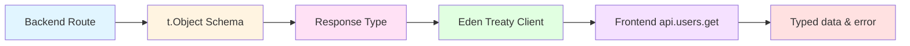

# Type Safety Patterns

**Version:** 1.11.0 | **Updated:** 2025-02-08

## Quick Facts

- Eden Treaty provides **automatic type inference** from backend to frontend
- Response schemas in routes generate TypeScript types
- No manual type definitions needed for API calls
- Refactoring backend automatically updates frontend types
- Type errors caught at compile time, not runtime

## Eden Treaty Type Flow



## Backend Schema Definition

**Step 1: Define response schema in route**

```typescript
// app/server/routes/users.routes.ts
import { Elysia, t } from 'elysia'

const UserSchema = t.Object({
  id: t.Number(),
  name: t.String(),
  email: t.String()
})

const GetUsersResponseSchema = t.Object({
  success: t.Boolean(),
  users: t.Array(UserSchema),
  count: t.Number()
})

export const usersRoutes = new Elysia({ prefix: '/users' })
  .get('/', async () => {
    return { 
      success: true, 
      users: [], 
      count: 0 
    }
  }, {
    response: GetUsersResponseSchema  // ← Type inference source
  })
```

## Frontend Type Inference

**Step 2: Use Eden Treaty client**

```typescript
// app/client/src/lib/api.ts
import { createEdenClient } from '@core/client/api/eden'
import type { App } from '@server/app'

export const api = createEdenClient<App>()
```

**Step 3: Make typed API calls**

```typescript
// app/client/src/pages/UsersPage.tsx
import { api } from '@/lib/api'

async function loadUsers() {
  const { data, error } = await api.users.get()
  
  // TypeScript knows the exact shape:
  // data: { success: boolean, users: User[], count: number } | undefined
  // error: Error | undefined
  
  if (error) {
    console.error('Failed to load users:', error)
    return
  }
  
  if (data) {
    // TypeScript knows data.users is User[]
    console.log(`Loaded ${data.count} users`)
    data.users.forEach(user => {
      // TypeScript knows user has id, name, email
      console.log(user.name, user.email)
    })
  }
}
```

## Type Inference Examples

### GET Request

```typescript
// Backend
.get('/users/:id', async ({ params }) => {
  return { 
    success: true, 
    user: { id: 1, name: 'John', email: 'john@example.com' } 
  }
}, {
  response: t.Object({
    success: t.Boolean(),
    user: UserSchema
  })
})

// Frontend - automatic type inference
const { data } = await api.users({ id: '123' }).get()
//    ^? { success: boolean, user: { id: number, name: string, email: string } } | undefined
```

### POST Request with Body

```typescript
// Backend
.post('/', async ({ body }) => {
  return { success: true, user: createdUser }
}, {
  body: t.Object({
    name: t.String({ minLength: 2 }),
    email: t.String({ format: 'email' })
  }),
  response: t.Object({
    success: t.Boolean(),
    user: UserSchema
  })
})

// Frontend - body type is inferred
const { data, error } = await api.users.post({
  name: 'Jane Doe',
  email: 'jane@example.com'
})
// TypeScript validates body matches schema
// TypeScript error if you pass { name: 123 } or forget email
```

### Multiple Status Codes

```typescript
// Backend
.post('/', async ({ body, set }) => {
  if (!body.name) {
    set.status = 400
    return { success: false, error: 'Name required' }
  }
  set.status = 201
  return { success: true, user: newUser }
}, {
  body: CreateUserSchema,
  response: {
    201: t.Object({
      success: t.Literal(true),
      user: UserSchema
    }),
    400: t.Object({
      success: t.Literal(false),
      error: t.String()
    })
  }
})

// Frontend - union type inferred
const { data } = await api.users.post({ name: 'John', email: 'john@example.com' })
//    ^? { success: true, user: User } | { success: false, error: string } | undefined

// Type narrowing with discriminated union
if (data?.success) {
  console.log(data.user.name)  // TypeScript knows user exists
} else if (data) {
  console.error(data.error)    // TypeScript knows error exists
}
```

### Query Parameters

```typescript
// Backend
.get('/', async ({ query }) => {
  const page = Number(query.page) || 1
  const limit = Number(query.limit) || 10
  return { users: [], page, limit, total: 0 }
}, {
  query: t.Object({
    page: t.Optional(t.String()),
    limit: t.Optional(t.String())
  }),
  response: t.Object({
    users: t.Array(UserSchema),
    page: t.Number(),
    limit: t.Number(),
    total: t.Number()
  })
})

// Frontend - query params typed
const { data } = await api.users.get({
  query: { page: '1', limit: '20' }
})
//    ^? { users: User[], page: number, limit: number, total: number } | undefined
```

## Shared Types

For types used across client and server, define in `app/shared/types/`:

```typescript
// app/shared/types/user.types.ts
export interface User {
  id: number
  name: string
  email: string
}

export interface CreateUserRequest {
  name: string
  email: string
}
```

**Use in backend:**
```typescript
import type { User, CreateUserRequest } from '@shared/types/user.types'

// Use for internal logic, not for schemas
async function createUser(data: CreateUserRequest): Promise<User> {
  // ...
}
```

**Use in frontend:**
```typescript
import type { User } from '@shared/types/user.types'

function UserCard({ user }: { user: User }) {
  return <div>{user.name}</div>
}
```

## Refactoring Safety

### Scenario: Add new field to User

**Step 1: Update backend schema**
```typescript
const UserSchema = t.Object({
  id: t.Number(),
  name: t.String(),
  email: t.String(),
  role: t.String()  // ← New field
})
```

**Step 2: Frontend automatically gets type error**
```typescript
// This code now has TypeScript error:
function UserCard({ user }: { user: User }) {
  return (
    <div>
      {user.name}
      {user.role}  // ← TypeScript error if User type doesn't include role
    </div>
  )
}
```

**Step 3: Update shared type**
```typescript
// app/shared/types/user.types.ts
export interface User {
  id: number
  name: string
  email: string
  role: string  // ← Add field
}
```

**Step 4: All type errors resolved**

### Scenario: Change response structure

**Before:**
```typescript
response: t.Object({
  users: t.Array(UserSchema)
})
```

**After:**
```typescript
response: t.Object({
  data: t.Object({
    users: t.Array(UserSchema),
    total: t.Number()
  })
})
```

**Frontend code breaks at compile time:**
```typescript
const { data } = await api.users.get()
console.log(data.users)  // ← TypeScript error: Property 'users' does not exist
                         //    Did you mean 'data.data.users'?
```

## Common Type Issues and Solutions

### Issue 1: Missing Response Schema

**Problem:**
```typescript
.get('/users', async () => {
  return { users: [] }
})
// No response schema defined
```

**Result:** Frontend loses type inference
```typescript
const { data } = await api.users.get()
//    ^? any
```

**Solution:** Always define response schema
```typescript
.get('/users', async () => {
  return { users: [] }
}, {
  response: t.Object({
    users: t.Array(UserSchema)
  })
})
```

### Issue 2: Type Mismatch Between Schema and Return

**Problem:**
```typescript
.get('/users', async () => {
  return { users: [], count: 0 }  // Returns count
}, {
  response: t.Object({
    users: t.Array(UserSchema)
    // Missing count in schema
  })
})
```

**Result:** Runtime data doesn't match types

**Solution:** Keep schema and return value in sync
```typescript
response: t.Object({
  users: t.Array(UserSchema),
  count: t.Number()  // ← Add to schema
})
```

### Issue 3: Using `any` Type

**Problem:**
```typescript
const { data } = await api.users.get() as any
data.anything  // No type checking
```

**Solution:** Trust Eden Treaty inference
```typescript
const { data } = await api.users.get()
// data is properly typed, no need for 'as any'
```

### Issue 4: Wrapping Eden Treaty

**Problem:**
```typescript
// DON'T DO THIS
async function apiCall(endpoint: string) {
  const response = await fetch(endpoint)
  return response.json()
}
```

**Result:** Loses all type inference

**Solution:** Use Eden Treaty directly
```typescript
// DO THIS
const { data, error } = await api.users.get()
```

## Type Safety Best Practices

**DO:**
- ✅ Define response schema for every route
- ✅ Use `t.Object()` for all schemas
- ✅ Define shared types in `app/shared/types/`
- ✅ Let Eden Treaty infer types automatically
- ✅ Use discriminated unions for multiple response types
- ✅ Trust TypeScript errors - they prevent runtime bugs

**DON'T:**
- ❌ Omit response schemas
- ❌ Use `any` type
- ❌ Wrap Eden Treaty in custom functions
- ❌ Ignore TypeScript errors
- ❌ Manually type API responses
- ❌ Use `as` type assertions unless absolutely necessary

## Type Inference Checklist

When creating a new API endpoint:

1. ✅ Define request body schema (if POST/PUT/PATCH)
2. ✅ Define response schema with `t.Object()`
3. ✅ Define all possible status code responses
4. ✅ Test frontend call to verify type inference
5. ✅ Check TypeScript errors in IDE
6. ✅ Verify autocomplete works in frontend

## Related

- [Routes with Eden Treaty](../resources/routes-eden.md)
- [Project Structure](./project-structure.md)
- [Anti-Patterns](./anti-patterns.md)
